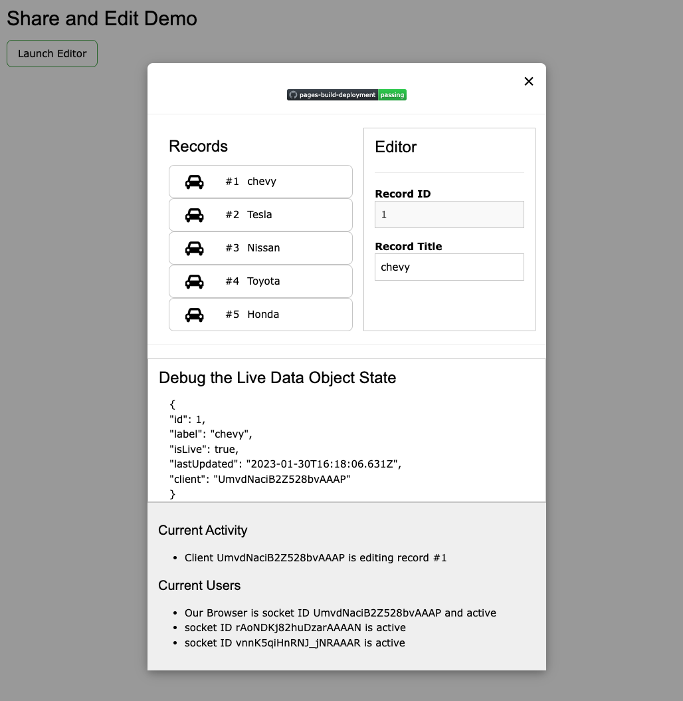

# shared edit demo

[](https://github.com/spydmobile/shareEdit/actions/workflows/pages/pages-build-deployment)

<div align="center">

[![licence badge]][licence link]

[![discord badge]][discord link]

[![latest release badge]][latest release link] [![github stars badge]][github stars link]

[![CI checks on main badge]][CI checks on main link] [![latest commit to app badge]][latest commit to app link]

[![github open issues badge]][github open issues link] [![github open app prs badge]][github open prs link]

[CI checks on main badge]: https://flat.badgen.net/github/status/spydmobile/shareEdit/main?label=CI%20status%20on%20main&cache=900&icon=github
[CI checks on main link]: https://github.com/spydmobile/shareEdit/actions/workflows/test-invoke-conda.yml

[licence badge]: https://flat.badgen.net/github/license/spydmobile/shareEdit
[licence link]: https://github.com/spydmobile/shareEdit/blob/main/LICENSE?icon=github

[discord badge]: https://flat.badgen.net/discord/members/nBuUfHuDtV?icon=discord
[discord link]: https://discord.gg/nBuUfHuDtV

[latest release badge]: https://flat.badgen.net/github/release/spydmobile/shareEdit/main?icon=github
[latest release link]: https://github.com/spydmobile/shareEdit/releases

[github stars badge]: https://flat.badgen.net/github/stars/spydmobile/shareEdit?icon=github
[github stars link]: https://github.com/spydmobile/shareEdit/stargazers

[github open issues badge]: https://flat.badgen.net/github/open-issues/spydmobile/shareEdit?icon=github
[github open issues link]: https://github.com/spydmobile/shareEdit/issues?q=is%3Aopen+is%3Aissue

[github open app prs badge]: https://flat.badgen.net/github/open-prs/spydmobile/shareEdit?icon=github&label=Open%20App%20PRs

[github open prs link]: https://github.com/spydmobile/shareEdit/pulls?q=is%3Apr+is%3Aopen
  
[latest commit to app badge]: https://flat.badgen.net/github/last-commit/spydmobile/shareEdit/main?icon=github&color=yellow&label=last%20App%20commit&cache=900

[latest commit to app link]: https://github.com/spydmobile/shareEdit/commits/main
  
</div>

Some research and development is required to be sure that the Live Object Editing paradigm is the right one for IntelliFire. I am building a proof of concept live demo, of the entire concept. the work is quite simple compared to IntelliFire, but this prototype will show that live object editing is superior to old school form to database editing.

In short, editing a record instantiates a live aware object across the active userspace, so as user 1 edits, record 5, all other users and their system are aware of this, and keeps users informed and insures that a record can only be edited by one person at a time.

The code is here (<https://github.com/spydmobile/shareEdit>) and a full report will be made to the team when I complete this R&D so we can move forward.

## Screenshot



## how it works

First, this is done using sockets, [Socket IO](https://socket.io/) in fact. so its incredibly fast and there is no http round trips to the backend except the initial one to load the application

Second, this demo does not cover off every single use case, but does illustrate the principle quite nicely.

When a user loads the UI, a known current copy of the dataset is cached into the browser space. When a use edits a record , a flat db record is  checked out of the database into a live object, this live object is sent to the client to work on, this live object keeps all the browsers in the loop as you work, and when you are done, the love objects is flattened back into a typical DB record and saved back to the database. When the edit is complete, the new state of the record is sent to all users and their local cache is updated with the latest record.

## Using the demo

### Installing the Demo

#### Clone the repo

```shell
git clone https://github.com/spydmobile/shareEdit.git
```

#### Install the dependencies

```cd shareEdit``` then from inside the repo folder

```npm i``` or ```pnpm i``` or ```yarn```

#### build the project

```shell
npm run build
```

#### Start the server

```shell
npm run serve
```

#### Access the application

The application will serve on port ```3301``` by default, so just point your browser to:

[http://localhost:3301](http://localhost:3301)
